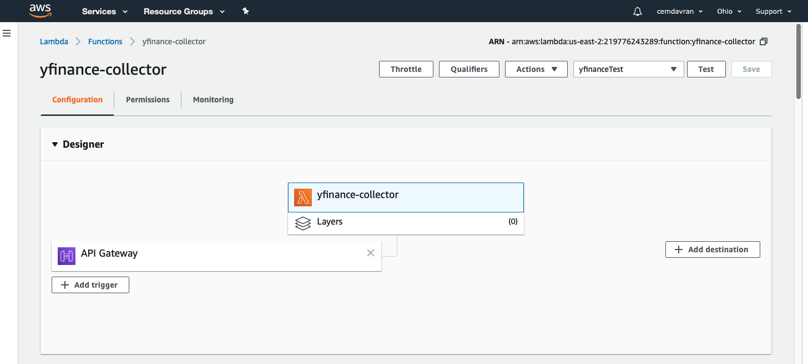
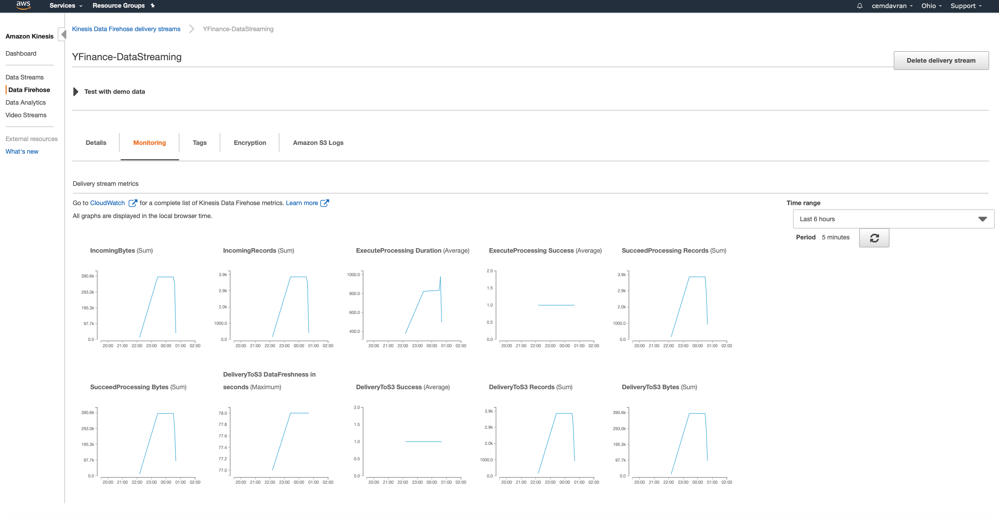

# Yahoo finance data streaming with aws lambda
I used yfinance module to get the pricing imformation of 10 different stocks.

- One-day(May 14th 2020) of high and low stock prices were pulled for each of those 10 company at an one minute interval.
- AWS lambda function(Data Collector) created to collect the stock data, transformed into a JSON format 
  and transformed  records were put into a firehose delivery stream to transferred into S3 bucket.
  
  ### AWS Services that used in this project
    * AWS Lambda (Data Collection and Transformation)
    * AWS Kinesis (Data Streaming)
    * AWS Glue & Athena (Data Query)
    * AWS S3 Buckets (Data Storage)
    

Lambda Function [URL](https://we83os9z5g.execute-api.us-east-2.amazonaws.com/default/yfinance-collector):   

https://we83os9z5g.execute-api.us-east-2.amazonaws.com/default/yfinance-collector

After running the query on AWS Athena, I downloaded the output file which contains the highest hourly stock per company.

Output csv file can be found as "Results_csv".

## AWS Lambda Configuration

## AWS Kinesis Stream Monitoring

